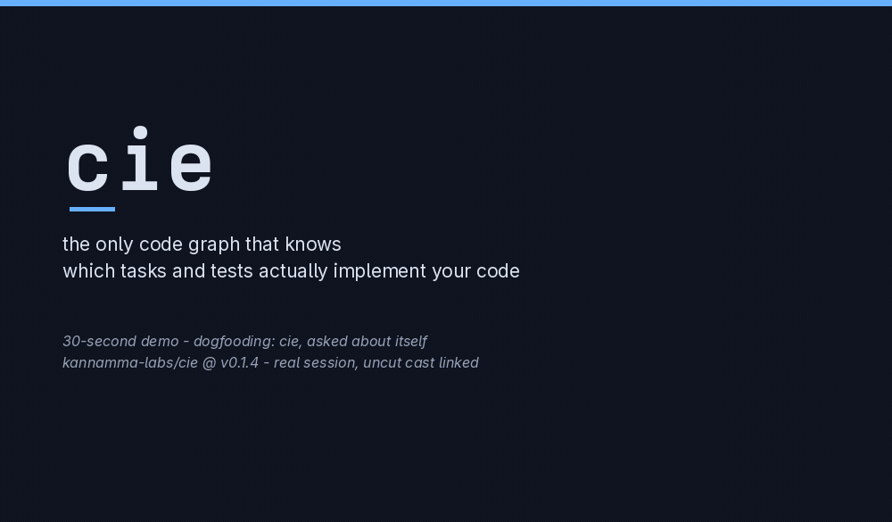

# cie — the only code graph that knows which tasks and tests actually implement your code.

> **Where this is going: [vision.md — the far shore](vision.md).** The graph becomes the software; repositories become its cache. Software that can always explain itself. *A compass, not a claim.*

[](https://github.com/kannamma-labs/cie/actions/workflows/ci.yml)
[](https://github.com/kannamma-labs/cie/releases)
[](LICENSE)
[](https://www.python.org/downloads/)
[](https://modelcontextprotocol.io)
[](https://tree-sitter.github.io/tree-sitter/)
[](https://neo4j.com)
[](tests/)
[](CHANGELOG.md)

[](https://github.com/kannamma-labs/cie/issues)
[](https://github.com/kannamma-labs/cie/pulls)
[](https://github.com/kannamma-labs/cie/graphs/contributors)
[](https://github.com/kannamma-labs/cie/stargazers)
[](https://github.com/kannamma-labs/cie/commits/main)
[](https://github.com/kannamma-labs/cie/commits/main)
[](https://github.com/kannamma-labs/cie)
[](https://github.com/kannamma-labs/cie)
[](#install)
[](https://github.com/kannamma-labs/cie/releases)

*Code Insight Engine.* No other surveyed code-graph tool can answer
"which files implement this task, and are they tested?" as one query.
**Everything developer-facing lives in the
[wiki](https://github.com/kannamma-labs/cie/wiki)** — architecture
written from the codebase, and a how-to for every workflow. This
README stays lean: the demo, the install, and how to help.



*Every second is a real recorded session, nothing staged: this repo
cloned from the public tag `v0.1.4`, `cie index .` in 1.9s (1,902
nodes · 6,581 edges · 4,169 calls), the README one-liner registering it
with Claude Code (`✔ Connected`), then ONE question in plain words —
about `resolve_backend`, the storage-selection rule — answered from
cie's tools alone (the agent's built-ins were disabled for the take:
`callers` → `affected_by` → `test_map` were its only path). The agent
returned the 7 pinning tests with line numbers, including the test
added for the explicit-`auto` bug fixed that same day. The GIF is
edited for time only — content is never edited; the uncut sessions
ship in the repo:
[`resolve-backend-uncut.cast`](docs/demo/resolve-backend-uncut.cast)
(the agent take) and
[`setup-uncut.cast`](docs/demo/setup-uncut.cast) (index → register →
connected). Full take/QC record:
[`docs/demo/production-log.md`](docs/demo/production-log.md).*

## Install

One-click, no clone, no Neo4j, no signup — install once from a release
tag, then one command per project indexes it, registers cie with your
MCP client (spawn-robust entry: absolute path, so GUI-launched clients
find it), and writes the agent context files:

```bash
# once per machine (latest tag):
uv tool install "cie-mcp[mcp] @ git+https://github.com/kannamma-labs/cie.git@v0.1.5"

# per project — from inside the project:
cie index .        # ~1.9s on a 110-file repo
cie init .         # registers the client, writes AGENTS.md/CLAUDE.md
```

Already installed and prefer the client-side route?

```bash
claude mcp add cie -- $(command -v cie-mcp) /path/to/your/project --backend embedded --policy readonly
```

Plain pip works too:

```bash
pip install "cie-mcp[mcp]"   # core + MCP server (cie-mcp) — what most people want
pip install "cie-mcp[http]"  # + the HTTP tool-mount (cie/routes.py)
```

> **Package-name note (updated 2026-08-31, v0.1.1):** the distribution
> ships as **`cie-mcp`** — the `cie` name on PyPI belongs to an unrelated
> project (`cluster311/cie10`, ICD-10 codes; `pip install cie` does NOT
> get you this tool — never did). Import package stays `cie`; console
> scripts stay `cie` and `cie-mcp`. GitHub installs are an equal
> alternative:
> `pip install "cie-mcp[mcp] @ git+https://github.com/kannamma-labs/cie.git@v0.1.5"`.

Core dependencies: Pydantic v2, tree-sitter (+ Python/JS/TS/Java/Go/
Rust/C/C++/C# grammars), watchdog, Click, Rich; the Neo4j driver only
when you use that backend. Python ≥ 3.10. Storage is **auto-selected**
(serve `.cie/graph.db` when you indexed, else Neo4j — stated on stderr
at startup, never silent).

**More**: serving to Cursor/Codex, multiple projects, Neo4j team mode,
semantic search, HTTP, policies, troubleshooting — every workflow has
a how-to in the [wiki](https://github.com/kannamma-labs/cie/wiki)
(start with
[install-and-serve](https://github.com/kannamma-labs/cie/wiki/How-to-install-and-serve-to-your-MCP-client)).

## Contributors wanted

cie is a small core with an outsized surface (135 tools, 9 languages,
two storage backends, three front-ends) and a culture you can see in
the commits: **DoD = verified against the real environment, never
written-only; misses get published, not hidden.** The demo above was
produced by dogfooding — and the dogfood measurement found (and fixed)
a real product bug the same day. That's the working style.

Ways in, easiest first:

- **Use it and report** — index your repo, ask it impact questions,
  file what's wrong or what's missing. The
  [troubleshoot how-to](https://github.com/kannamma-labs/cie/wiki/How-to-troubleshoot)
  lists the known sharp edges honestly.
- **A measured gap** — the direct-calls TESTS heuristic shipped because
  a dogfood measurement showed 1 edge in a 308-test suite. Find a
  number like that, and the fix gets in.
- **A first PR** — start with the
  [`good first issue`](https://github.com/kannamma-labs/cie/issues?q=is%3Aissue+is%3Aopen+label%3A%22good+first+issue%22)
  label (each names a safe entry-point module and acceptance criteria)
  or issues #17–#19.
- **Docs** — wiki how-tos count. If you wished a page existed, write
  it; if the wiki and code disagree, the code wins and the wiki gets a
  PR.

Dev setup is three commands (clone, `uv venv` + editable install,
`python -m pytest -q` — 312 passing): the details, the conformance
harness, and the honesty bar are in
[CONTRIBUTING.md](CONTRIBUTING.md) and the wiki's
[contributing page](https://github.com/kannamma-labs/cie/wiki/Contributing-%28details%29).
CONTRIBUTING.md's "Becoming a second maintainer" section is the path
beyond a one-off PR.

## License

cie is released under the [MIT License](LICENSE).

By contributing, you agree your contributions are licensed under the
same terms.